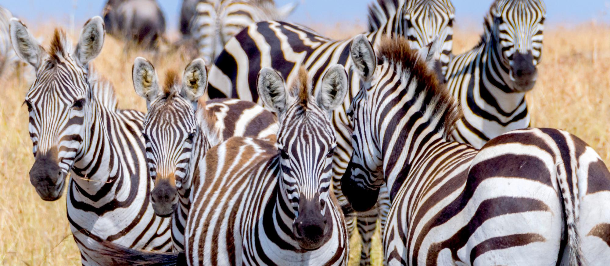

# ZCash Foundation Website

## General Instructions For Developers

> The tl;dr is that almost everything we're currently keeping here: https://github.com/ZcashFoundation/
> ...should be part of our Jekyll instance, displayable as normal, non-GitHub interface web pages. That way we can continue using GitHub for workflow, and people who are comfortable with it can navigate our files there, but everyone else is able to look at the regular website. Since we're mostly working with .md files anyway, I think that's pretty doable. For reference, here is the current state of our website: https://github.com/ZcashFoundation/zcashfoundation.github.io

### Priorities

> My technical priorities for the website:
>  -  Fast-loading
>  -  Minimal dependencies
>  -  Easy to maintain
>  -  Doesn't break any existing URLs / redirect anything that moves
> Not breaking URLs is a little tricky because there are a million links to our GitHub repos floating around the internet — perhaps the easiest thing will be to archive everything on GitHub and add disclaimers to each document like "please go look at our website instead because it's the maintained source of truth." Suggestions welcome.

## Adding Images

The folder `images/src` is for the images you get pretty much anywhere - all of the images that you haven't yet optimized for the web. Put them in there, and then run:

```sh
# In the main directory
$ gulp
```

...which will go around shrinking them. As an example, it took the `zeal-zcash-foundation-feature-image.jpg` and shrunk it down to a fourth of the size that it was before.

If you don't have Gulp installed, you can get it by doing this:

```sh
$ npm install --global gulp
# And, in this directory...
$ npm install
```

Never embed images in `images/src` in a blogpost; they should always be copied over to `images` automatically by Gulp, and that will ensure that you're serving up nice issues to your users. The way to embed them is using this syntax:

```markdown
Look at our zealous zebras!


```

Note that the path is relative to where the Markdown file is. This will look pretty much like this:


You _can_ add images directly to images without running Gulp, but they just won't be as small as your users might like. But that's always an option as needed.

## Contribute

Work here is largely being done by @RichardLitt and co. If you really want to help out, open an issue?

**Still got questions about how this works?**

Ping [@RichardLitt](mailto:richard@burntfen.com) if you've got questions about this, on GitHub at @RichardLitt or on Twitter at [@richlitt](https://twitter.com/richlitt).

## License

[MIT](LICENSE) © 2018 Burnt Fen Creative LLC. For now.
